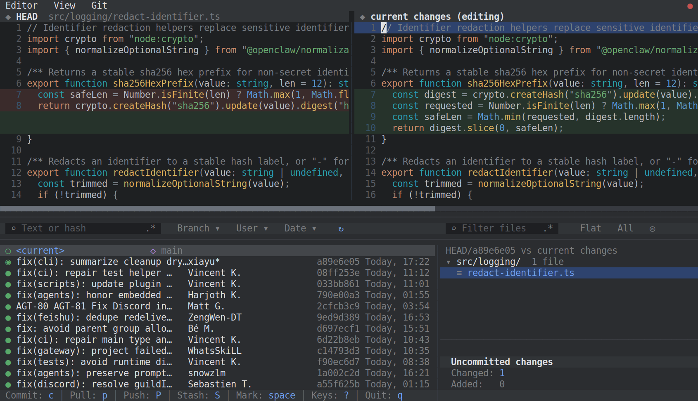
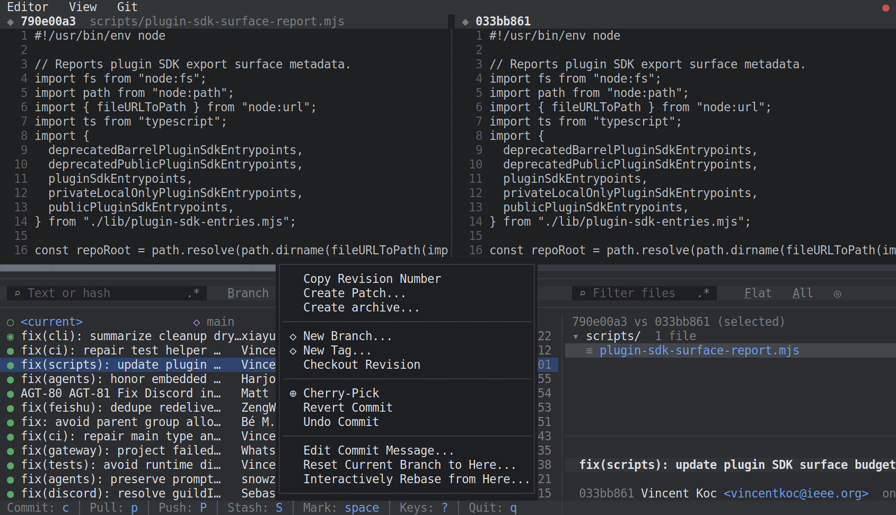
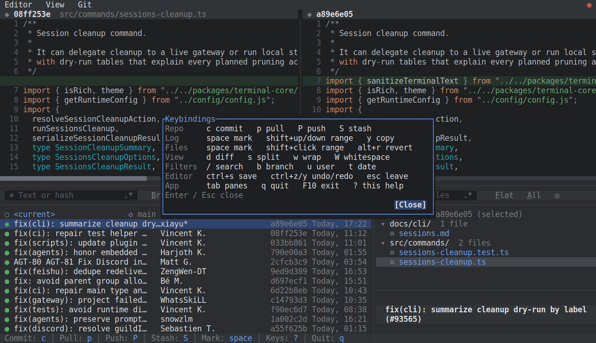

# gitgit

**Full-fledged git in your terminal - the JetBrains Git client (IntelliJ, PyCharm,
WebStorm), in a TUI.**

The full JetBrains Git panel - commit graph, diff viewer, branch / stash / patch
tools - keyboard and mouse, in your terminal. The diff is live, too: edit the working
file right inside it (click, type, `Ctrl+S`) - no separate edit mode, no `$EDITOR`.



[](https://www.rust-lang.org)
[](https://ratatui.rs)
[](LICENSE)

## Why

Most terminal git tools show you a diff and make you leave to change it. gitgit
collapses the loop: the working file is live and editable right in the diff, with
real editor affordances and syntax highlighting on both sides. Browse history on the
left, edit the present on the right.

It drives a **real repository** (no demo mode): reads through `git2`, and routes
every write to the system `git` so your hooks, config, and credentials all apply.

Right-click any commit for the actions the JetBrains panel gives you - cherry-pick,
revert, reset, interactive rebase, create patch, archive:



## Features

- **Editable diff** - the synthetic `<current>` row's right side is your working
  file; edit, then `Ctrl+S` (or autosave on navigate). History rows are read-only
  "what this commit changed".
- **Mouse-first editor in the diff** - click to place the caret, drag / double-click /
  triple-click to select, plus full keyboard selection, clipboard, undo/redo, and
  syntax highlight - side-by-side or unified.
- **Commit graph log** - hollow node = unpushed/working, filled = pushed; branch and
  tag chips whose fill encodes local vs remote. `<current>` row pins the working tree
  on top with a live `+N ~N -N` badge.
- **Full git workflow** - commit / amend / tag, branches / merge / rebase pickers,
  one-click "Update Project" (smart fetch + ff-pull), stash, create / apply patch,
  manage remotes, archive a commit or the tree.
- **Per-file and bulk ops** - right-click a file, folder, or a multi-selected set for
  commit / rollback / patch / compare / history / blame. Multi-commit cherry-pick and
  numbered patch-series from the log.
- **Blame** - a per-line blame gutter beside the editable diff (`View > Blame`), plus
  a one-shot full-file annotate overlay.
- **Fast filtering** - filter the log by branch, user, or date; live file search; a
  remembered search history.
- **Diff comfort** - word wrap, whitespace glyphs, fold unchanged regions, a draggable
  horizontal scrollbar for long lines, per-hunk revert.
- **Auto-refresh** - the panes track on-disk changes via a cheap 2s status poll, no
  flag needed; an open editor buffer and caret survive the refresh.
- **lazygit muscle memory** - a context-sensitive bottom hint bar and bare keys
  (`c` commit, `p` pull, `P` push, `S` stash, `?` keys). Mouse fully supported too.
- **Sticky** - toggles, pane splits, and search history persist across runs.

## How it compares

gitgit stands on the shoulders of tools worth admiring. Where they stop is roughly
where it begins:

- **[lazygit](https://github.com/jesseduffield/lazygit)** - fast and feature-packed,
  but the diff is dense and unified-only, hard to read at a glance. gitgit makes the
  diff the main event: spacious side-by-side, syntax-highlighted, foldable - and editable.
- **[hunk](https://github.com/modem-dev/hunk)** - a beautiful, focused diff/review
  experience and nothing else. gitgit takes that "the diff is the product" idea and
  wraps a whole git client around it - log graph, branches, stash, remotes, patches.
- **[gitui](https://github.com/gitui-org/gitui)** - a superb client whose author keeps
  it keyboard-only on purpose: *"mouse support is not really a focus for me"*
  ([#226](https://github.com/gitui-org/gitui/issues/226)). gitgit makes the opposite
  bet - it is mouse-first, built around click-to-edit, drag-to-select, and wheel-scroll -
  without giving up a single hotkey.

## Install

Prebuilt binary (Linux / macOS, x86_64 / arm64) - installs to `~/.local/bin`:

```sh
curl -fsSL https://raw.githubusercontent.com/asidko/gitgit/main/install.sh | sh
```

Remove it with the same script:

```sh
curl -fsSL https://raw.githubusercontent.com/asidko/gitgit/main/install.sh | sh -s -- --remove
```

Or build with Cargo (any platform with a Rust toolchain):

```sh
cargo install --git https://github.com/asidko/gitgit
```

## Usage

Run it inside any git repository:

```sh
gitgit
```



Key bindings (also under `?` in-app):

- **Navigate** - `Tab` cycles Log / Files / Diff; arrows move; mouse clicks and the
  wheel work everywhere.
- **Repo** - `c` commit, `p` pull, `P` push, `S` stash; the top `Git` menu has the rest.
- **Log** - `space` marks a commit, `Shift+Up/Down` range-marks (cherry-pick / patch a set).
- **Editor** (on the `<current>` diff) - type to edit, `Ctrl+S` save, `Ctrl+Z/Y` undo/redo,
  `Esc` leaves editing.
- **View** - `s` side-by-side toggle, `d` diff, `W` whitespace; `View` menu for word wrap,
  hide-unchanged, blame.
- **Quit** - `q` or `F10`.

Flags:

- `gitgit --watch` - also reload periodically (catches ref / remote changes a status
  poll cannot see).
- `gitgit snapshot <W> <H> [out.json] [--real]` - render one frame headless (used by the
  tests / tooling).

## Configuration

Optional. gitgit reads `~/.config/gitgit/config.toml` if present (missing = sane
defaults), and remembers runtime toggles in `state.toml` beside it.

```toml
[repo]
path = "/path/to/repo"   # default: current directory

[view]
diff_mode = "side"  # or "unified"
word_wrap = false

[behavior]
mouse = true
commit_cap = 300            # commits loaded before "load more"
```

## Build from source

```sh
cargo build --release      # binary at target/release/gitgit
cargo test                 # unit + integration + golden-render tests
```

## Architecture

A small Elm-style core: `apply(Msg)` is pure and IO-free, the runtime owns all IO,
clock, and geometry, and layering is strict (`git -> store -> ui`, enforced by a test).
All git IO lives behind one `GitBackend` trait on a worker thread, so the UI never
blocks. Rendering is a pure function of state; a golden snapshot test ratchets the
default frame byte-for-byte.

## License

MIT - see [LICENSE](LICENSE).
